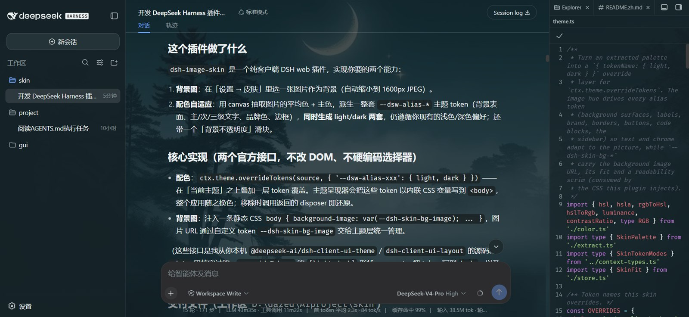
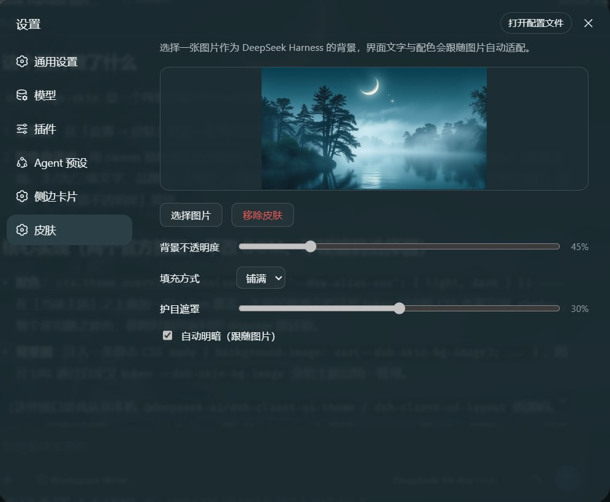

# dsh-image-skin

[English](README.md) | 中文

DSH web 插件：给 DeepSeek Harness 设置一张背景图，并根据图片的配色自动适配界面文字、背景、品牌色与边框色。

> 本插件使用 [DeepSeek Harness](https://github.com/deepseek-ai/deepseek-harness) 生成。

## 截图

| 效果图 | 设置页面 |
| --- | --- |
|  |  |

## 功能

- **背景图**：选择任意图片作为应用背景（自动缩小到 1600px JPEG，存储友好）。
- **配色自适应**：从图片中抽取平均色 + 主色，派生出一整套 `--dsw-alias-*` / `--dsw-specific-*` 主题 token（背景表面、主/次/三级文字、品牌色、边框、按钮、代码块、侧边栏），同时给出 **light / dark 两套**，仍遵循你现有的浅色/深色偏好。
- **文字对比度保证**：派生文字色时用 WCAG 相对亮度校验「文字 vs 表面」对比度（主/次文字 ≥4.5:1，三级/说明文字 ≥3:1），不足自动压暗/提亮。
- **不透明度**：滑块控制主背景的不透明度；弹框/菜单/侧边栏等叠层只**轻微跟随**（始终 ≥80% 不透明），避免文字重叠。
- **填充方式**：`铺满 / 适应 / 拉伸`（cover / contain / stretch）。
- **护目遮罩**：在图片上叠一层按图片色调派生的白/黑蒙版，忙碌图片上的文字更好读。
- **自动明暗**：可勾选「跟随图片」——图片偏亮则切浅色主题、偏暗则切深色主题；关闭或移除皮肤时恢复你原来的浅/深/系统偏好（通过 `ctx.theme.register` 注册一个空 token 的主题做方案载体，不覆盖你的持久化偏好）。
- **持久化**：图片与全部选项存在 `localStorage`，刷新后自动恢复。
- **设置入口**：注册一个「皮肤」设置分区（`settings.section`），随 DSH 语言自动切换中英文。

## 原理

插件通过两个官方接口完成所有工作，不改 DOM 结构、不硬编码产品选择器：

1. **`ctx.theme.overrideTokens(source, tokens)`** —— 在「当前主题」之上叠加一层 token 覆盖（`{ '--dsw-alias-xxx': { light, dark } }`）。主题呈现器会把这些 token 以内联 CSS 变量写到 `<body>` 上，因此整个应用的配色随之改变。移除皮肤时调用返回的 disposer 即可还原。
2. **注入一段静态 CSS** —— `body { background-image: var(--dsh-skin-bg-image), ...; }`。图片 URL、填充方式与遮罩色通过自定义 token（`--dsh-skin-bg-*`）传给主题呈现器，同样由 token 层统一管理、随层一起撤销。
3. **`ctx.theme.register` + `ctx.theme.setTheme`（自动明暗）** —— 勾选「跟随图片」时，按图片亮度注册一个空 token 的主题（`colorScheme: light|dark`）并设为当前方案；真正的配色仍来自 `overrideTokens` 层。内置偏好只有 `light/dark/system` 会写回 settings，自定义 id 是进程内的，因此不会覆盖你的持久化偏好；关闭或移除皮肤时恢复进入自动前的偏好。

## 目录结构

```
src/index.ts               # host 半：无操作挂载点（皮肤完全在客户端）
src/context-types.ts       # 结构化的 ctx 类型镜像 + @deepseek-ai/cordis 扩展
src/client/index.tsx       # client 半：overrideTokens + CSS 注入 + 设置分区注册
src/client/SkinSettings.tsx# 设置 UI（上传 / 预览 / 不透明度 / 移除）
src/client/theme.ts        # 调色板 → token 覆盖层
src/client/extract.ts      # 图片缩小 + 主色/平均色/亮度抽取（canvas）
src/client/color.ts        # 纯色彩数学（RGB/HSL/亮度）
src/client/store.ts        # localStorage 持久化
cordis.patch.yml           # bundle patch：把插件挂载进 profile
scripts/build.mjs          # esbuild 构建（host ESM + client 模块加载器包壳）
scripts/smoke.mjs          # 冒烟验证（host 导出 + client bundle 契约）
```

## 开发

需要 Node.js **≥ 22.13**（pnpm 11 的要求）与 pnpm 11。

```sh
pnpm install
pnpm build        # 产出 lib/index.js 与 lib/client.js（esbuild + tsc 声明）
pnpm typecheck    # tsc --noEmit
pnpm smoke        # 冒烟验证：host 导出 + client bundle 契约（无需浏览器）
```

## 安装到你的 web profile

**方式一：本地开发（link 源码，推荐）**

```sh
cd <本仓库目录>
pnpm install && pnpm build

# 一步安装并自动挂载（无需手改任何文件）
dsh plugin --profile web add link:<本仓库的绝对路径>
```

然后重启 DSH、浏览器**硬刷新**（Ctrl/Cmd+Shift+R）。`dsh plugin` 检测到 `dsh.bundle.patch` 会自动把插件追加进 `dsh.profile.bundles`。

本项目不发布到 npm（`package.json` 已设 `"private": true`），个人使用走方式一即可；如日后要公开发布，见 `AGENTS.md`。

> 注意：不要同时用两种方式挂载同一插件（会加载两份）。若 profile 的 `cordis.patch.yml` 里还残留旧的手写 `insert` 挂载行，切到 bundle 通道前先删掉。

## 卸载

**bundle 通道（`dsh plugin add` 安装的）**：

```sh
dsh plugin --profile web remove dsh-image-skin
```

这会移除依赖、卸载包，并自动把它从 `dsh.profile.bundles` 剔除。重启 DSH + 硬刷新即可。

**手动 link 安装的**：从 `~/.dsh/profiles/web/package.json` 删掉 `dsh-image-skin` 依赖，从 `cordis.patch.yml` 删掉 `image-skin` 的 `insert` 块，再 `pnpm install`、重启。

**清理皮肤数据**：图片存于浏览器 `localStorage` 的 `dsh-image-skin.v1`，卸载前先在设置页点「移除皮肤」，或在 DevTools → Application → Local Storage 删除该键。

## 注意事项

- **client 半改动**只需硬刷新浏览器；**host 半改动**（本插件 host 为空）才需要重启 DSH。
- 图片以 `data:image/jpeg` 存进 `localStorage`，单张约几百 KB，远小于 5MB 配额。
- 移除皮肤会调用 `overrideTokens` 返回的 disposer，界面立即回到原主题。

## 已知限制

- 极端高饱和图片可能让个别表面色偏浓；已对背景饱和度做了封顶（`sat ≤ 45`），且弹框/菜单等叠层始终 ≥80% 不透明以保住可读性。

## License

[MIT](LICENSE)

本项目为第三方社区插件，与 DeepSeek / DeepSeek Harness 无官方隶属关系；相关名称与标识归其各自所有者所有。
